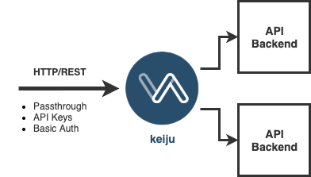

# Keiju – Minimalist API Gateway

* Simplicity wins over Feature Completeness
* Supports API Keys & Basic Auth
* Detailed Request/Response Logging in JSON on STDOUT
* Control & Configure via API
* Runs on Docker, k8s, knative, OpenShift, Google Cloud Run etc.
* Stateful (embedded Redis) by default, or use external Redis




## Run Keiju with Docker

`docker run -d -p 8080:8080 u1ih/keiju:latest`

## Example 1: Register & Consume an API (Passthrough)

We're using an API from the [Yoisho Open Banking Project](http://yoisho.dob.jp/):

```
curl -u admin:changeme -X POST \
  http://localhost:8080/config/apis \
  -d 'name=exchange' \
  -d 'url=http://backend.yoisho.dob.jp/fx'
```

Response:

> {"name": "currency", "url": "http://backend.yoisho.dob.jp/fx", "methods": "['GET', 'POST', 'PUT', 'DELETE']", "auth": "none"}

We didn't excplitcly set the allowed methods or authentication, so the default values (all methods, no authentication) are used.

Now we consume the 'protected' API:

`curl "http://localhost:8080/exchange/currency?currency=USD"`

> {"name": "exchange", "url": "http://backend.yoisho.dob.jp/fx", "methods": ["GET", "POST", "PUT", "DELETE"], "auth": "none", "swagger": "not\_implemented\_yet"}


## Example 2: Basic Authentication

### Register API

```
curl -u admin:changeme -X POST \
  http://localhost:8080/config/apis \
  -d 'name=currency' \
  -d 'auth=basic' \
  -d 'url=http://backend.yoisho.dob.jp/fx'
```

### Create User

```
curl -X POST -u admin:changeme \
http://localhost:8080/config/basic-auth \
-d 'username=uli' -d 'password=bla'`

```

### Consume API with Basic Auth

coming

## Example 3: API Keys

### Register API

```
curl -u admin:changeme -X POST \
  http://localhost:8080/config/apis \
  -d 'name=currency' \
  -d 'auth=apikey' \
  -d 'url=http://backend.yoisho.dob.jp/fx'
```

### Create API Key

```
curl -X POST -u admin:changeme \
http://localhost:8080/config/apikeys

```

### Consume API with Basic Auth

coming

## Example 4: Only Allow Certain HTTP Methods for API

Simply add 'methods' to the list of parameters:

```
curl -u admin:changeme -X POST \
  http://localhost:8080/config/apis \
  -d 'name=atm' \
  -d 'url=http://backend.yoisho.dob.jp/banking/v2' \
  -d 'methods=GET,POST'
```

## Admin Stuff & More Details

### List all APIs

`curl -u admin:changeme http://localhost:8080/config/apis`

### Delete an API

`curl -u admin:changeme -X DELETE http://localhost:8080/config/apis/currency`

### Change Admin Password

`curl -u admin:changeme -X PUT http://localhost:8080/config/password --data "password=newpassword"`

### Get 'raw' API Key, not in JSON

```
curl -X POST -u admin:changeme \
"http://localhost:8080/config/apikeys?raw"
```

### Stateless Container

Connect to external Redis by setting the environment variables redis_host, redis_port, redis_password (optional).

### So an API Key or Basic Auth gets you access to all APIs? No 'applications'?

Yes. Simplicity.

### How does Logging work?

`docker logs CONTAINER_ID`

### What about HTTPS ?

I suggest to have nginx, haproxy, k8s etc. take care of that. Try running it on Google Cloud Run!

### Keoju?

A japanese name. But it also means fairy in Finnish.

### Coming soon

* Rate-Limits
* Swagger Passthrough/Parse
* TTL for API Keys
